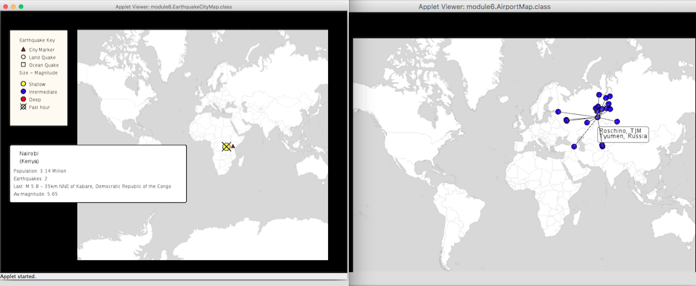
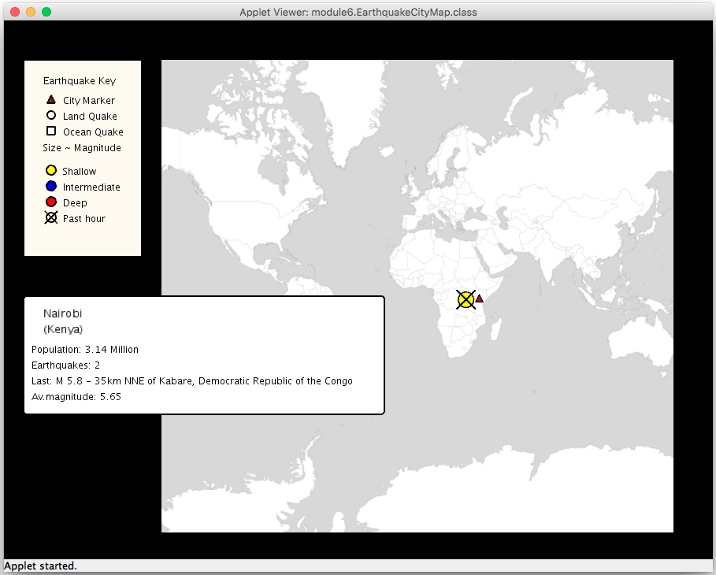

# Unfolding_maps

The project for the course "Object Oriented Programming in Java".

The project uses the Processing library (https://processing.org/reference/libraries/) and is implemented as a PApplet.

Besides completing the required methods, two extensions were implemented:

1.  AIRPORTS WHERE I TRAVELED

Airports Map:
The map shows the airports I traveled to. When you hover over an airport, its name, code, city and country are displayed. When you click on an airport, the routes and destination airports from this airport are displayed, everything else is hidden.

2. EARTHQUAKES THREATENING CITIES

When you click on a city, a window with some earthquake related information about the city id displayed under the key, it includes: the name of the city, country, the number of earthquakes this city is in the threat circle of, the name and the place of the most recent earthquake close to this city, the average magnitude of all the earthquakes this city was affected by.

In EarthquakeCityMap class:

* implemented the display() method that sets the instructions on how to draw the information panel and what information to print for the lastClicked city marker: it calls getCity(), getCountry(), getPopulation(), numberOfEarthquakes(), mostRecentQuake(), averageMagnitude() methods to display information and processing library methods for modifying shapes and texts;
* added a call to display() in the draw() method;
* implemented  numberOfEarthquakes() method that counts all the earthquakes close to the city (according to the size of the threat circle);
* implemented  mostRecentQuake () method that compares the time of the earthquakes the clicked city in in the threat circle of, finds the most recent one and gets its name by calling getTitle() method. If there is not one, it returns a string "No recent quake";
* implemented averageMagnitude()  methods that calculates average magnitude of the quakes that affect the clicked city;
* implemented a compareTime() method that compares the year, month, day and time of an earthquake step by step and returns the most recent one.

__Additions__:

In ParseFeed class:

* modified parseEarthquake() method so that it parses the information about the time of the earthquake;

In EarthquakeMarker class:

* added getters getMonth(), getYear(), getDay(), getTime() to use in compareTime() method;

In AirportMap class:

* implemented data structures: List <String> MyCities containing cities read from a file, ArrayList <Marker> airportsTo containing destination airports from a clicked airport, erases after each click;
* implemented readMyAirports() method that reads a text file into a List of Strings MyCities;
* implemented modified methods mouseMoved(), selectMarkerIfHover(), mouseClicked(), unhideMarkers() similar to the ones in the previous assignments; 
* implemented checkAirportsForClick(), showDestinations(), displayRoutes() methods;  checkAirportsForClick() checks if an airport was clicked, calls showDestinations() method that hides markers that are not clicked and not destination airports for a clicked marker, displayRoutes() that unhides the route markers from a clicked airport;
* added getters and setters.
